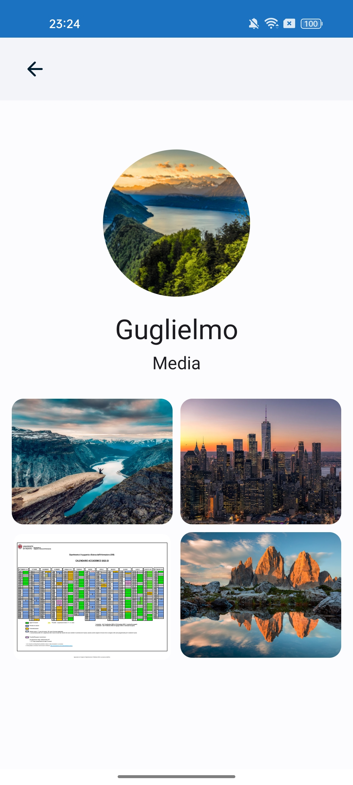
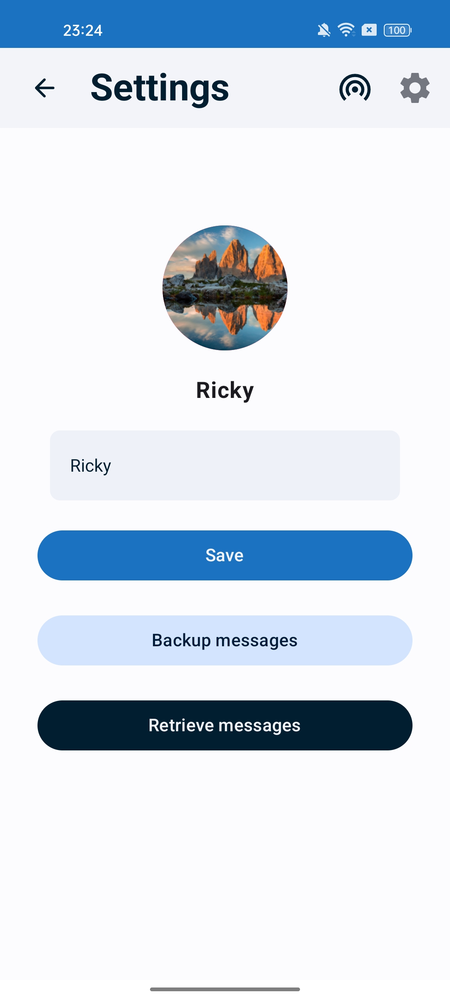
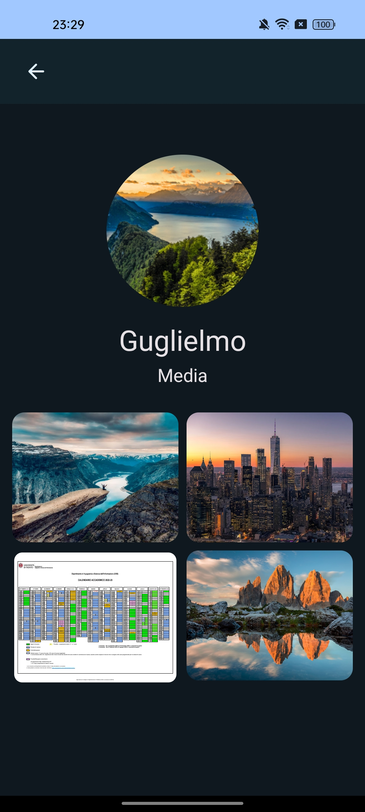

# Flydrop2p

Flydrop2p is an ongoing university project developed in Kotlin and Compose.

## Description

Flydrop2p aims to be a peer-to-peer messaging application leveraging WiFi Direct technology. The primary objective of the project is to create a messaging app that operates without requiring an Internet connection. This makes the application particularly useful in scenarios where Internet access is limited or unavailable.

## Key Features

- Instant messaging via WiFi Direct.
- Peer-to-peer chat functionality without the need for an Internet connection.
- Modern and intuitive user interface built with Kotlin and Compose.

## Installation

As the project is still under development, installation instructions will be provided upon release of the stable version.

## Usage

Once installed, users will be able to launch the application and utilize its instant messaging features. To send a message, they can select the desired chat and type their message into the text box at the bottom. Pressing the send button will deliver the message.

## Screens

## Screens

| **Home Screen**               | **Chat Screen**               | **Info Screen**               |
|:-----------------------------:|:-----------------------------:|:-----------------------------:|
|  |  |  |
| **Settings Screen**           | **Chat Dark Screen**          | **Info Dark Screen**          |
|  |  |  |
